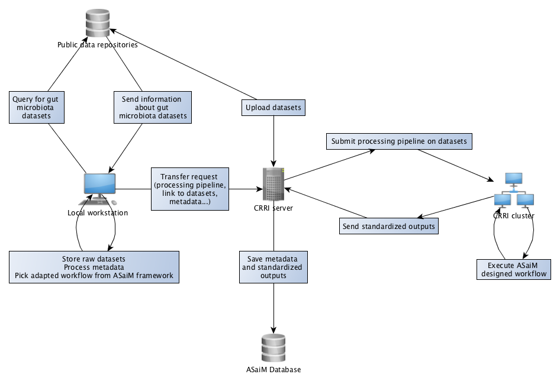
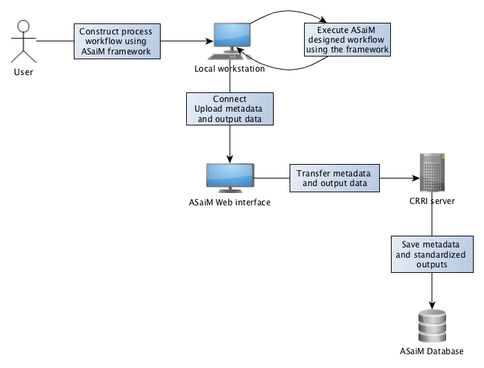
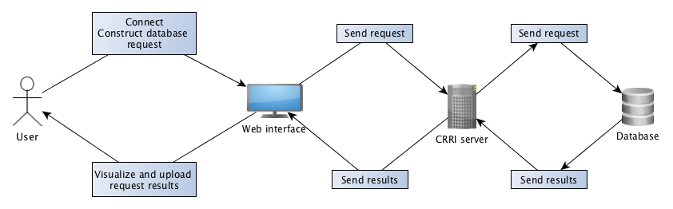

.. _environment-solution:

Solution 
========

ASaiM (*Auvergne Sequence analysis of intestinal Microbiota*) is an environment to analyze intestinal microbiota: 

.. image:: assets/images/general_scheme.png

This environment is composed of:

- Framework to process gut microbiota data and to standardize the outputs
- Database which takes an inventory of gut microbiota data from public data repositories and users
- Web interface to submit and query the database (and the framework) 

The components are interfaced given several use cases.

1. The database is filled with data from public data repositories after analyses with workflow generated with the framework

2. Data processing and analyses by users with the framework

3. Database query with the web interface

